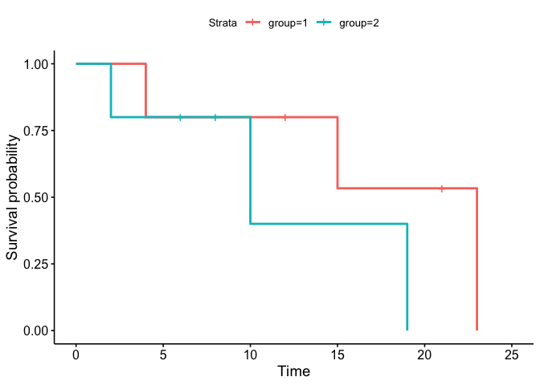
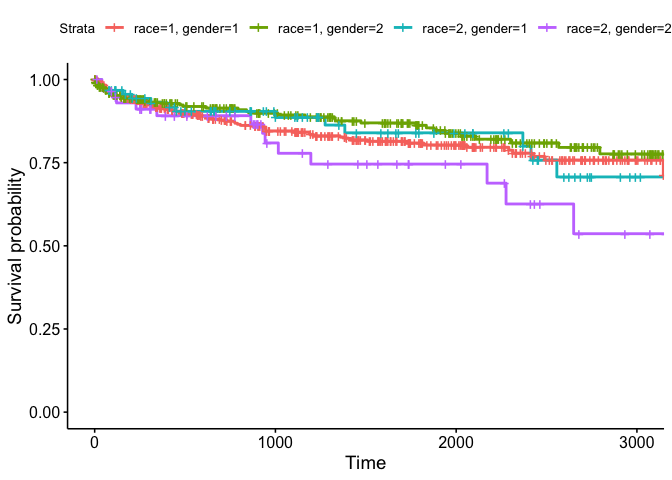
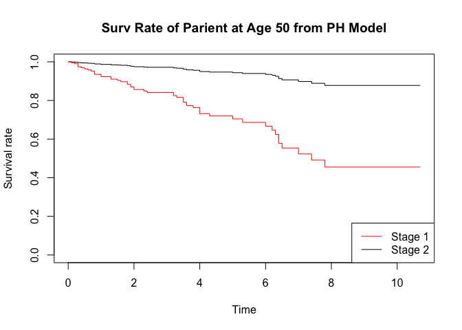

Homework 10
================
Yuki Joyama
2024-04-26

# 1

Group 1: 4, 12+, 15, 21+, 23  
Group 2: 2, 6+, 8+, 10, 19  
$H_0$: $h_1(t)=h_2(t)$ for all t  
$H_1$: $h_1(t)\neq h_2(t)$ for some t

``` r
df = tibble(
  group = rep(c(1, 2), each = 5),
  time = c(4, 12, 15, 21, 23, 2, 6, 8, 10, 19),
  delta = c(1, 0, 1, 0, 1, 1, 0, 0, 1, 1)
)

str(df)
```

    ## tibble [10 × 3] (S3: tbl_df/tbl/data.frame)
    ##  $ group: num [1:10] 1 1 1 1 1 2 2 2 2 2
    ##  $ time : num [1:10] 4 12 15 21 23 2 6 8 10 19
    ##  $ delta: num [1:10] 1 0 1 0 1 1 0 0 1 1

``` r
# check censored
Surv(df$time, df$delta, type = "right")
```

    ##  [1]  4  12+ 15  21+ 23   2   6+  8+ 10  19

``` r
# log-rank test
survdiff(Surv(time, delta) ~ group, data = df)
```

    ## Call:
    ## survdiff(formula = Surv(time, delta) ~ group, data = df)
    ## 
    ##         N Observed Expected (O-E)^2/E (O-E)^2/V
    ## group=1 5        3     4.14     0.313      1.15
    ## group=2 5        3     1.86     0.697      1.15
    ## 
    ##  Chisq= 1.1  on 1 degrees of freedom, p= 0.3

``` r
# plot survival function 
ggsurvplot(survfit(Surv(time, delta) ~ group, data = df), xlab = "Time") 
```

<!-- -->

P-value \> 0.05 suggests that we cannot reject the null hypothesis.
Thus, we can conclude that $h_1(t)=h_2(t)$ for all t .

# 2

``` r
data(kidtran)
str(kidtran)
```

    ## 'data.frame':    863 obs. of  6 variables:
    ##  $ obs   : int  1 2 3 4 5 6 7 8 9 10 ...
    ##  $ time  : int  1 5 7 9 13 13 17 20 26 26 ...
    ##  $ delta : int  0 0 1 0 0 0 1 0 1 1 ...
    ##  $ gender: int  1 1 1 1 1 1 1 1 1 1 ...
    ##  $ race  : int  1 1 1 1 1 1 1 1 1 1 ...
    ##  $ age   : int  46 51 55 57 45 43 47 65 55 44 ...

Let’s compare the survival curves for different races in each sex group.

In the log-rank test, I set the hypotheses as follows:  
$H_0$: the death times of kidney transplant patients are identical among
four groups  
$H_1$: the death times of kidney transplant patients are not the same
among four groups

``` r
# log-rank test
survdiff(Surv(time, delta) ~ race + gender, data = kidtran)
```

    ## Call:
    ## survdiff(formula = Surv(time, delta) ~ race + gender, data = kidtran)
    ## 
    ##                    N Observed Expected (O-E)^2/E (O-E)^2/V
    ## race=1, gender=1 432       73    69.25    0.2025    0.4013
    ## race=1, gender=2 280       39    47.39    1.4860    2.2531
    ## race=2, gender=1  92       14    14.52    0.0184    0.0205
    ## race=2, gender=2  59       14     8.84    3.0173    3.2245
    ## 
    ##  Chisq= 4.7  on 3 degrees of freedom, p= 0.2

``` r
# plot survival function 
ggsurvplot(survfit(Surv(time, delta) ~ race + gender, data = kidtran), xlab = "Time") 
```

<!-- -->

The result (p-value \> 0.05) indicates that we cannot reject the null
hypothesis; hence, there is no statistically significant difference in
the survival curves among four groups.

# 3

``` r
data(larynx)

df <- as_tibble(larynx) |> 
  mutate(
    z1 = ifelse(stage == 2, 1, 0),
    z2 = ifelse(stage == 3, 1, 0),
    z3 = ifelse(stage == 4, 1, 0),
    z4 = age
  )

str(df)  
```

    ## tibble [90 × 9] (S3: tbl_df/tbl/data.frame)
    ##  $ stage : int [1:90] 1 1 1 1 1 1 1 1 1 1 ...
    ##  $ time  : num [1:90] 0.6 1.3 2.4 2.5 3.2 3.2 3.3 3.3 3.5 3.5 ...
    ##  $ age   : int [1:90] 77 53 45 57 58 51 76 63 43 60 ...
    ##  $ diagyr: int [1:90] 76 71 71 78 74 77 74 77 71 73 ...
    ##  $ delta : int [1:90] 1 1 1 0 1 0 1 0 1 1 ...
    ##  $ z1    : num [1:90] 0 0 0 0 0 0 0 0 0 0 ...
    ##  $ z2    : num [1:90] 0 0 0 0 0 0 0 0 0 0 ...
    ##  $ z3    : num [1:90] 0 0 0 0 0 0 0 0 0 0 ...
    ##  $ z4    : int [1:90] 77 53 45 57 58 51 76 63 43 60 ...

Let  
`z1` = 1 if the patient is in stage 2, 0 otherwise;  
`z2` = 1 if the patient is in stage 3, 0 otherwise;  
`z3` = 1 if the patient is in stage 4, 0 otherwise;  
`z4` = age of the patient (in years);

Now, I will fit a proportional hazards model using the covariates `z1`,
`z2`, `z3`, `z4` and the interaction term `z1`\*`z4`.

``` r
fit = coxph(Surv(time, delta) ~ factor(z1) + factor(z2) + factor(z3) + z4 + (factor(z1) * z4), data = df, ties = "breslow")

summary(fit)
```

    ## Call:
    ## coxph(formula = Surv(time, delta) ~ factor(z1) + factor(z2) + 
    ##     factor(z3) + z4 + (factor(z1) * z4), data = df, ties = "breslow")
    ## 
    ##   n= 90, number of events= 50 
    ## 
    ##                      coef  exp(coef)   se(coef)      z Pr(>|z|)    
    ## factor(z1)1    -7.3820143  0.0006223  3.4027542 -2.169   0.0301 *  
    ## factor(z2)1     0.6218044  1.8622853  0.3558078  1.748   0.0805 .  
    ## factor(z3)1     1.7534270  5.7743576  0.4239595  4.136 3.54e-05 ***
    ## z4              0.0059729  1.0059908  0.0148792  0.401   0.6881    
    ## factor(z1)1:z4  0.1116674  1.1181409  0.0476728  2.342   0.0192 *  
    ## ---
    ## Signif. codes:  0 '***' 0.001 '**' 0.01 '*' 0.05 '.' 0.1 ' ' 1
    ## 
    ##                exp(coef) exp(-coef) lower .95 upper .95
    ## factor(z1)1    0.0006223  1606.8231 7.900e-07    0.4903
    ## factor(z2)1    1.8622853     0.5370 9.272e-01    3.7403
    ## factor(z3)1    5.7743576     0.1732 2.516e+00   13.2550
    ## z4             1.0059908     0.9940 9.771e-01    1.0358
    ## factor(z1)1:z4 1.1181409     0.8943 1.018e+00    1.2277
    ## 
    ## Concordance= 0.682  (se = 0.04 )
    ## Likelihood ratio test= 24.11  on 5 df,   p=2e-04
    ## Wald test            = 23.77  on 5 df,   p=2e-04
    ## Score (logrank) test = 27.98  on 5 df,   p=4e-05

Significant p-values (\< 0.05) indicate that the corresponding variables
`factor(z1)1`, `factor(z3)1`, and `factor(z1)1:z4` have a significant
effect on survival.  
All else being equal, being Stage 2 patients reduce the hazard by a
factor of 0.00062 (vs Stage 1 patients); being Stage 4 patients increase
the hazard by a factor of 5.77 (vs Stage 1 patients). There seems to be
an interaction between Stage 2 patients and age.

The relative risk of dying for a Stage 2 patient of age 50 vs Stage 1
patient of age 50 can be calculated as follows:  
$\text{RR} = \frac{h_2(t)}{h_1(t)}=\frac{e^{-7.3820143+50\times0.0059729}}{e^{50\times0.0059729}}\approx0.00062$

``` r
# plot the survival rate curve
fit2 = survfit(fit, newdata = data.frame(z4 = 50, z1 = 1, z2 = 0, z3 = 0))
fit1 = survfit(fit, newdata = data.frame(z4 = 50, z1 = 0, z2 = 0, z3 = 0))

plot(fit2, col = "black", xlab = "Time", ylab = "Survival rate", conf.int = FALSE, main = "Surv Rate of Parient at Age 50 from PH Model")
lines(fit1, col = "red", conf.int = FALSE) 
legend("bottomright", c("Stage 1", "Stage 2"), col = c("red", "black"), lty = 1)
```

<!-- -->
