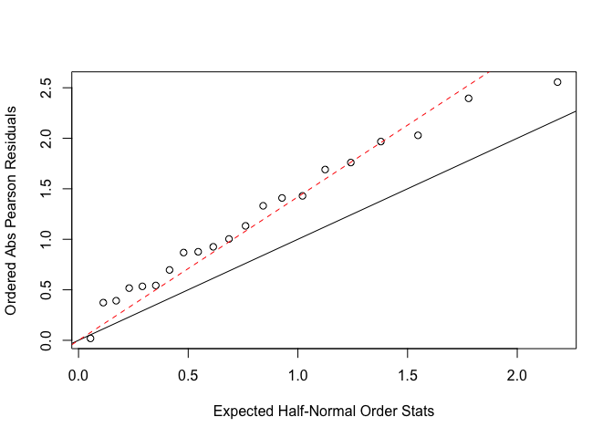

Homework 3
================
Yuki Joyama
2024-02-27

## 1

``` r
# data prep
df_ec = data.frame(
  age = c(25, 25, 35, 35, 45, 45, 55, 55, 65, 65, 75, 75),
  alcohol = c(rep(c("less", "more"), length.out = 12)),
  case = c(0, 1, 5, 4, 21, 25, 24, 42, 36, 19, 8, 5),
  control = c(106, 9, 164, 26, 138, 29, 139, 27, 88, 18, 31, 0)
) 

resp = cbind(df_ec$case, df_ec$control) 
```

We coded daily alcohol consumption 0-79g as “less”, and 80+g as “more”.

### a

``` r
# fit a prospective logit model
logit.prosp = glm(resp ~ df_ec$alcohol + df_ec$age, family = binomial(link = 'logit'))

summary(logit.prosp) 
```

    ## 
    ## Call:
    ## glm(formula = resp ~ df_ec$alcohol + df_ec$age, family = binomial(link = "logit"))
    ## 
    ## Coefficients:
    ##                    Estimate Std. Error z value Pr(>|z|)    
    ## (Intercept)       -5.142771   0.432049 -11.903   <2e-16 ***
    ## df_ec$alcoholmore  1.887764   0.190502   9.909   <2e-16 ***
    ## df_ec$age          0.061805   0.007485   8.258   <2e-16 ***
    ## ---
    ## Signif. codes:  0 '***' 0.001 '**' 0.01 '*' 0.05 '.' 0.1 ' ' 1
    ## 
    ## (Dispersion parameter for binomial family taken to be 1)
    ## 
    ##     Null deviance: 214.750  on 11  degrees of freedom
    ## Residual deviance:  29.988  on  9  degrees of freedom
    ## AIC: 76.03
    ## 
    ## Number of Fisher Scoring iterations: 4

``` r
exp(coef(logit.prosp)) # odds ratio estimates
```

    ##       (Intercept) df_ec$alcoholmore         df_ec$age 
    ##       0.005841482       6.604582479       1.063755249

In this model, we treat disease status (case vs control) as response and
exposures (daily alcohol consumption and age) as predictors.

$logit(\pi_i)=\beta_0+\beta_1x_1+\beta_2x_2$  
$x_1:$ the indicator of heavier daily alcohol consumption (80+g)  
$x_2:$ the indicator of age (as a continuous variable)

- The odds ratio of having esophageal cancer is 6.605 in heavier daily
  alcohol consumer (80+g) compared to lighter consumer (0-79g) holding
  other covariates constant  
- As age increases by one year, the odds ratio of having esophageal
  cancer increases by 1.064 holding other covariates constant

### b

$\Psi_j:$ the odds ratio relating alcohol consumption and disease in the
$j^{th}$ age group ($j = 1,..., 6$)  
Compare the following two models:  
$M_0:\Psi_j=1$ for all $j$  
$M_1:\Psi_j=\Psi$ (where $\Psi$ is an unknown constant)

``` r
# Model 0 has age (as categorical variable) as a covariate
m0 = glm(resp ~ factor(df_ec$age), family = binomial(link = 'logit'))

summary(m0)
```

    ## 
    ## Call:
    ## glm(formula = resp ~ factor(df_ec$age), family = binomial(link = "logit"))
    ## 
    ## Coefficients:
    ##                     Estimate Std. Error z value Pr(>|z|)    
    ## (Intercept)           -4.745      1.004  -4.725 2.31e-06 ***
    ## factor(df_ec$age)35    1.695      1.061   1.598 0.110006    
    ## factor(df_ec$age)45    3.456      1.018   3.394 0.000688 ***
    ## factor(df_ec$age)55    3.823      1.015   3.767 0.000165 ***
    ## factor(df_ec$age)65    4.089      1.018   4.017 5.90e-05 ***
    ## factor(df_ec$age)75    3.876      1.057   3.666 0.000246 ***
    ## ---
    ## Signif. codes:  0 '***' 0.001 '**' 0.01 '*' 0.05 '.' 0.1 ' ' 1
    ## 
    ## (Dispersion parameter for binomial family taken to be 1)
    ## 
    ##     Null deviance: 214.75  on 11  degrees of freedom
    ## Residual deviance: 101.67  on  6  degrees of freedom
    ## AIC: 153.71
    ## 
    ## Number of Fisher Scoring iterations: 6

``` r
# Model 1 has alcohol and age (as categorical variable) as covariates
m1 = glm(resp ~ df_ec$alcohol + factor(df_ec$age), family = binomial(link = 'logit'))

summary(m1)
```

    ## 
    ## Call:
    ## glm(formula = resp ~ df_ec$alcohol + factor(df_ec$age), family = binomial(link = "logit"))
    ## 
    ## Coefficients:
    ##                     Estimate Std. Error z value Pr(>|z|)    
    ## (Intercept)          -5.0937     1.0105  -5.041 4.64e-07 ***
    ## df_ec$alcoholmore     1.7876     0.1931   9.259  < 2e-16 ***
    ## factor(df_ec$age)35   1.5300     1.0670   1.434 0.151586    
    ## factor(df_ec$age)45   3.1882     1.0241   3.113 0.001851 ** 
    ## factor(df_ec$age)55   3.5160     1.0207   3.445 0.000572 ***
    ## factor(df_ec$age)65   3.9749     1.0242   3.881 0.000104 ***
    ## factor(df_ec$age)75   3.9857     1.0666   3.737 0.000186 ***
    ## ---
    ## Signif. codes:  0 '***' 0.001 '**' 0.01 '*' 0.05 '.' 0.1 ' ' 1
    ## 
    ## (Dispersion parameter for binomial family taken to be 1)
    ## 
    ##     Null deviance: 214.750  on 11  degrees of freedom
    ## Residual deviance:  12.963  on  5  degrees of freedom
    ## AIC: 67.005
    ## 
    ## Number of Fisher Scoring iterations: 5

$\Psi_j =1$ means that the coefficient of alcohol (log odds) equals to
zero in Model 0.  
Model 0 is nested within Model 1, so I will perform ANOVA for the
deviance analysis.

``` r
# deviance analysis for nested models
anova(m0, m1)
```

    ## Analysis of Deviance Table
    ## 
    ## Model 1: resp ~ factor(df_ec$age)
    ## Model 2: resp ~ df_ec$alcohol + factor(df_ec$age)
    ##   Resid. Df Resid. Dev Df Deviance
    ## 1         6    101.671            
    ## 2         5     12.963  1   88.708

The residual deviance appears to be reduced in Model 1 compared to Model
0, indicating that Model 1 has a better fit by adding alcohol as the
response variable.

## 2

``` r
# data prep
df_ger <- data.frame(
  seeds = c(rep(c("oa_75", "oa_73"), times = c(11, 10))),
  root = c(rep(c("bean", "cucumber"), times = c(5, 6)), rep(c("bean", "cucumber"), times = c(5, 5))),
  y = c(10, 23, 23, 26, 17, 5, 53, 55, 32, 46, 10, 8, 10, 8, 23, 0, 3, 22, 15, 32, 3),
  m = c(39, 62, 81, 51, 39, 6, 74, 72, 51, 79, 13, 16, 30, 28, 45, 4, 12, 41, 30, 51, 7)
) 

# response variable
resp = cbind(df_ger$y, df_ger$m - df_ger$y) 
```

### a

``` r
# fit a logistic regression model
logit.ger = glm(resp ~ df_ger$seeds + df_ger$root, family = binomial(link = 'logit'))

summary(logit.ger) 
```

    ## 
    ## Call:
    ## glm(formula = resp ~ df_ger$seeds + df_ger$root, family = binomial(link = "logit"))
    ## 
    ## Coefficients:
    ##                     Estimate Std. Error z value Pr(>|z|)    
    ## (Intercept)          -0.7005     0.1507  -4.648 3.36e-06 ***
    ## df_ger$seedsoa_75     0.2705     0.1547   1.748   0.0804 .  
    ## df_ger$rootcucumber   1.0647     0.1442   7.383 1.55e-13 ***
    ## ---
    ## Signif. codes:  0 '***' 0.001 '**' 0.01 '*' 0.05 '.' 0.1 ' ' 1
    ## 
    ## (Dispersion parameter for binomial family taken to be 1)
    ## 
    ##     Null deviance: 98.719  on 20  degrees of freedom
    ## Residual deviance: 39.686  on 18  degrees of freedom
    ## AIC: 122.28
    ## 
    ## Number of Fisher Scoring iterations: 4

``` r
exp(coef(logit.ger)) # odds ratio estimates
```

    ##         (Intercept)   df_ger$seedsoa_75 df_ger$rootcucumber 
    ##           0.4963454           1.3105554           2.9001133

In this model, we treat germination status (germinated vs not
germinated) as a response variable and exposures (types of seed and root
extract) as predictors.

$logit(\pi_i)=\beta_0+\beta_1x_1+\beta_2x_2$  
$x_1:$ the type of seeds  
$x_2:$ the type of root extract media

- The odds ratio of having germination is 1.311 in *O. aegyptiaca 75*
  compared to *O. aegyptiaca 73* holding other covariates constant.
  However, given p-value \> 0.05 of this coefficient, no statistically
  significant association is implied between the type of seeds and the
  germination status  
- The odds ratio of having germination is 2.9 in cucumber compared to
  bean root extract holding other covariates constant

### b

``` r
# goodness of fit
hltest(logit.ger)
```

    ## 
    ##    The Hosmer-Lemeshow goodness-of-fit test
    ## 
    ##  Group Size Observed  Expected
    ##      1  123       49  40.79973
    ##      2  272       99 107.20027
    ##      3  141       75  83.20027
    ##      4  295      201 192.79973
    ## 
    ##          Statistic =  6.47991 
    ## degrees of freedom =  2 
    ##            p-value =  0.039166

The Hosmer-Lemeshow goodness-of-fit test indicates that the model in (a)
has a lack of fit.

``` r
# calculate dispersion parameter
G.stat = sum(residuals(logit.ger, type = 'pearson') ^ 2) # pearson chisq 
G.stat
```

    ## [1] 38.31062

``` r
phi = G.stat / (21 - 2)
phi
```

    ## [1] 2.016348

``` r
tilde.phi = logit.ger$deviance / logit.ger$df.residual
tilde.phi 
```

    ## [1] 2.204772

``` r
# test over-dispersion (half normal plot)
res = residuals(logit.ger, type='pearson')
plot(qnorm((21 + 1: 21 + 0.5)/(2 * 21 + 1.125)), sort(abs(res)), xlab = 'Expected Half-Normal Order Stats', ylab = 'Ordered Abs Pearson Residuals')
abline(a = 0, b = 1)
abline(a = 0, b = sqrt(phi), lty = 2, col = 'red')
```

<!-- -->

There is a linear deviation from the reference line in the half normal
plot, suggesting that the response variance $Y_i$ exceeds the variance
assumed by the model.  
Hence, we can say that there is over-dispersion in the original model.  
The estimate of dispersion parameter: $\hat\phi=$ 2.02

``` r
summary(logit.ger, dispersion = phi)
```

    ## 
    ## Call:
    ## glm(formula = resp ~ df_ger$seeds + df_ger$root, family = binomial(link = "logit"))
    ## 
    ## Coefficients:
    ##                     Estimate Std. Error z value Pr(>|z|)    
    ## (Intercept)          -0.7005     0.2140  -3.273  0.00106 ** 
    ## df_ger$seedsoa_75     0.2705     0.2197   1.231  0.21828    
    ## df_ger$rootcucumber   1.0647     0.2048   5.199    2e-07 ***
    ## ---
    ## Signif. codes:  0 '***' 0.001 '**' 0.01 '*' 0.05 '.' 0.1 ' ' 1
    ## 
    ## (Dispersion parameter for binomial family taken to be 2.016348)
    ## 
    ##     Null deviance: 98.719  on 20  degrees of freedom
    ## Residual deviance: 39.686  on 18  degrees of freedom
    ## AIC: 122.28
    ## 
    ## Number of Fisher Scoring iterations: 4

After adjusting for over-dispersion, the coefficient for the type of
seeds still has p-value larger than 0.05.  
This implies that no statistically significant association is detected
between the type of seeds and response variable in the updated model.

### c

One of plausible cause of the over-dispersion in this experiment is the
potential heterogeneity of the data within each group. We do not know
how old each seed was, what the room temperature and humidity were
during the observation period, or how much water each seed received.
Many underlying factors may affect seed germination and our data
classification/model cannot account for them.
