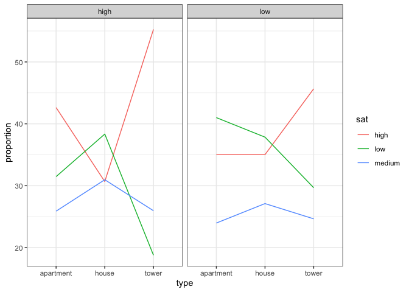

Homework 4
================
Yuki Joyama
2024-02-29

``` r
# data prep
df_house = data.frame(
  contact = c(rep(c("low", "high"), times = c(3, 3))),
  type = c(rep(c("tower", "apartment", "house"), length.out = 3)), 
  sat.low = c(65, 130, 67, 34, 141, 130),
  sat.medium = c(54, 76, 48, 47, 116, 105),
  sat.high = c(100, 111, 62, 100, 191, 104)
)
```

## 1

``` r
# calculate row-wise percentages
df_house$sat.low_per <- (df_house$sat.low / rowSums(df_house[, c("sat.low", "sat.medium", "sat.high")])) * 100
df_house$sat.medium_per <- (df_house$sat.medium / rowSums(df_house[, c("sat.low", "sat.medium", "sat.high")])) * 100
df_house$sat.high_per <- (df_house$sat.high / rowSums(df_house[, c("sat.low", "sat.medium", "sat.high")])) * 100

# table of percentages
df_house[-(3:5)]
```

    ##   contact      type sat.low_per sat.medium_per sat.high_per
    ## 1     low     tower    29.68037       24.65753     45.66210
    ## 2     low apartment    41.00946       23.97476     35.01577
    ## 3     low     house    37.85311       27.11864     35.02825
    ## 4    high     tower    18.78453       25.96685     55.24862
    ## 5    high apartment    31.47321       25.89286     42.63393
    ## 6    high     house    38.34808       30.97345     30.67847

``` r
# plot
df_house |> 
  dplyr::select(contact, type, sat.low_per, sat.medium_per, sat.high_per) |> 
  pivot_longer(cols = starts_with("sat."), 
               names_to = "sat", 
               values_to = "proportion") |> 
  mutate(sat = str_remove(sat, "sat\\.") |>  str_remove("_per")) |> 
# plot
  ggplot(aes(x = type, y = proportion, group = sat, color = sat)) +
  geom_line() +
  facet_grid(~contact) +
  theme_bw()
```

<!-- -->

## 2

``` r
# fit a nominal logistic regression model
house.mult <- multinom(cbind(sat.low, sat.medium, sat.high) ~ factor(contact) + factor(type), data = df_house)
```

    ## # weights:  15 (8 variable)
    ## initial  value 1846.767257 
    ## iter  10 value 1803.046285
    ## final  value 1802.740161 
    ## converged

``` r
summary(house.mult)
```

    ## Call:
    ## multinom(formula = cbind(sat.low, sat.medium, sat.high) ~ factor(contact) + 
    ##     factor(type), data = df_house)
    ## 
    ## Coefficients:
    ##            (Intercept) factor(contact)low factor(type)house factor(type)tower
    ## sat.medium  -0.2180364         -0.2959832        0.06967922         0.4067631
    ## sat.high     0.2474047         -0.3282264       -0.30402275         0.6415948
    ## 
    ## Std. Errors:
    ##            (Intercept) factor(contact)low factor(type)house factor(type)tower
    ## sat.medium  0.10930968          0.1301046         0.1437749         0.1713009
    ## sat.high    0.09783068          0.1181870         0.1351693         0.1500774
    ## 
    ## Residual Deviance: 3605.48 
    ## AIC: 3621.48

``` r
# goodness of fit
pihat = predict(house.mult,type = 'probs') 
pihat
```

    ##     sat.low sat.medium  sat.high
    ## 1 0.2739485  0.2460866 0.4799649
    ## 2 0.3967554  0.2372941 0.3659505
    ## 3 0.4306997  0.2761849 0.2931154
    ## 4 0.2154984  0.2602598 0.5242418
    ## 5 0.3241708  0.2606645 0.4151647
    ## 6 0.3562423  0.3071247 0.3366329

``` r
m = rowSums(df_house[, 3:5])

# pearson residuals 
res.pearson = (df_house[, 3:5] - pihat*m) / sqrt(pihat*m) 
res.pearson
```

    ##      sat.low  sat.medium   sat.high
    ## 1  0.6462082  0.01458006 -0.4986448
    ## 2  0.3770510  0.08967620 -0.4648120
    ## 3 -1.0575683 -0.12653898  1.4047956
    ## 4 -0.8014220 -0.01559243  0.5248140
    ## 5 -0.3508834 -0.07196683  0.3670803
    ## 6  0.8402535  0.08670506 -0.9471979

``` r
# Generalized Pearson Chisq Stat
G.stat = sum(res.pearson^2) 
G.stat
```

    ## [1] 6.932341

``` r
pval = 1 - pchisq(G.stat, df = (6 - 4)*(3 - 1))
pval # fit is good, do not reject the model
```

    ## [1] 0.1395072

``` r
# deviance
D.stat = sum(2*df_house[, 3:5]*log(df_house[, 3:5] / (m*pihat)))
D.stat
```

    ## [1] 6.893028

## 3

``` r
# fit a ordinal logistic regression model
```

## 4

``` r
# Pearson residuals 
```
