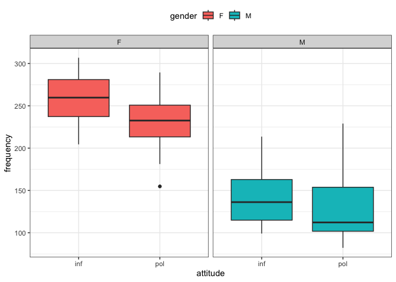

Homework 7
================
Yuki Joyama
2024-04-01

``` r
# data prep
df = read_csv("HW7-politeness_data.csv")
```

## (a) Exploratory Analysis

``` r
# gender/attitude and pitch
df |> 
  ggplot(aes(x = attitude, y = frequency, fill = gender)) +
  geom_boxplot() +
  facet_wrap(~gender)
```

<!-- -->

``` r
gender <- df$gender
attitude <- df$attitude
subject <- df$subject
frequency <- df$frequency
scenario <- df$scenario
```

The boxplots illustrates the relation between gender/attitude and pitch.
We can see that Female tend to have higher frequency than Male, and
lower frequency is more likely to be considered as formal (pol).

## (b) LMM with random intercepts

I will fit a mixed effects model with random intercepts for different
subjects with gender and attitude being the fixed effects.

``` r
# LMM with random intercept
# gender, attitude fixed
LMM1 <- lme(frequency ~ gender + attitude, random = ~1 | subject, method = "REML")

summary(LMM1)
```

    ## Linear mixed-effects model fit by REML
    ##   Data: NULL 
    ##        AIC      BIC    logLik
    ##   806.0805 818.0527 -398.0402
    ## 
    ## Random effects:
    ##  Formula: ~1 | subject
    ##         (Intercept) Residual
    ## StdDev:    24.45803 29.11537
    ## 
    ## Fixed effects:  frequency ~ gender + attitude 
    ##                  Value Std.Error DF   t-value p-value
    ## (Intercept)  256.98690 15.154986 77 16.957251  0.0000
    ## genderM     -108.79762 20.956235  4 -5.191659  0.0066
    ## attitudepol  -20.00238  6.353495 77 -3.148248  0.0023
    ##  Correlation: 
    ##             (Intr) gendrM
    ## genderM     -0.691       
    ## attitudepol -0.210  0.000
    ## 
    ## Standardized Within-Group Residuals:
    ##        Min         Q1        Med         Q3        Max 
    ## -2.3564422 -0.5658319 -0.2011979  0.4617895  3.2997610 
    ## 
    ## Number of Observations: 84
    ## Number of Groups: 6

The covariance matrix for a subject Yi:

``` r
VarCorr(LMM1)
```

    ## subject = pdLogChol(1) 
    ##             Variance StdDev  
    ## (Intercept) 598.1953 24.45803
    ## Residual    847.7049 29.11537

The covariance matrix for the estimates of fixed effects:

``` r
vcov(LMM1)
```

    ##             (Intercept)       genderM   attitudepol
    ## (Intercept)   229.67362 -2.195819e+02 -2.018345e+01
    ## genderM      -219.58189  4.391638e+02  2.879122e-15
    ## attitudepol   -20.18345  2.879122e-15  4.036690e+01

The best linear unbiased predictions (BLUPs) for subject-specific
intercepts:

``` r
random.effects(LMM1)
```

    ##    (Intercept)
    ## F1  -13.575831
    ## F2   10.170522
    ## F3    3.405309
    ## M3   27.960288
    ## M4    4.739325
    ## M7  -32.699613

Residuals:

``` r
head(LMM1$residuals)
```

    ##        fixed   subject
    ## 1 -23.684524 -10.10869
    ## 2 -52.486905 -38.91107
    ## 3  48.115476  61.69131
    ## 4   2.713095  16.28893
    ## 5 -33.084524 -19.50869
    ## 6  29.913095  43.48893

# (c) LMM with random intercepts and interaction

I will fit a mixed effects model with random intercepts for different
subjects with gender, attitude and their interaction being the fixed
effects.

``` r
# LMM with random intercept
# gender, attitude, gender*attitude fixed
LMM2 <- lme(frequency ~ gender + attitude + gender*attitude, random = ~1 | subject, method = "REML")

summary(LMM2)
```

    ## Linear mixed-effects model fit by REML
    ##   Data: NULL 
    ##        AIC     BIC    logLik
    ##   799.8018 814.094 -393.9009
    ## 
    ## Random effects:
    ##  Formula: ~1 | subject
    ##         (Intercept) Residual
    ## StdDev:    24.46382 29.04716
    ## 
    ## Fixed effects:  frequency ~ gender + attitude + gender * attitude 
    ##                          Value Std.Error DF   t-value p-value
    ## (Intercept)          260.68571 15.481307 76 16.838740  0.0000
    ## genderM             -116.19524 21.893875  4 -5.307203  0.0061
    ## attitudepol          -27.40000  8.964149 76 -3.056620  0.0031
    ## genderM:attitudepol   14.79524 12.677221 76  1.167073  0.2468
    ##  Correlation: 
    ##                     (Intr) gendrM atttdp
    ## genderM             -0.707              
    ## attitudepol         -0.290  0.205       
    ## genderM:attitudepol  0.205 -0.290 -0.707
    ## 
    ## Standardized Within-Group Residuals:
    ##        Min         Q1        Med         Q3        Max 
    ## -2.2344163 -0.5454437 -0.1646159  0.4697182  3.1800944 
    ## 
    ## Number of Observations: 84
    ## Number of Groups: 6

The output indicates that the interaction term does not have a
significant influence on the response variable.

Now, I will refit LMM1 and LMM2 using ML method for the likelihood ratio
test.

``` r
LMM1.1 <- lme(frequency ~ gender + attitude, random = ~1 | subject, method = "ML")
LMM2.1 <- lme(frequency ~ gender + attitude + gender*attitude, random = ~1 | subject, method = "ML")

# LRT of interaction 
anova(LMM1.1, LMM2.1)
```

    ##        Model df      AIC      BIC    logLik   Test  L.Ratio p-value
    ## LMM1.1     1  5 825.6363 837.7904 -407.8182                        
    ## LMM2.1     2  6 826.2508 840.8357 -407.1254 1 vs 2 1.385523  0.2392

Given the result (p-value \> 0.05), we fail to reject the null
hypothesis. Therefore, we conclude that including the interaction term
is not significantly associated with pitch.

4)  LMM with random intercept for both subject and scenarios I will fit
    a mixed effects model with random intercepts for different subjects
    and scenarios with gender and attitude being the fixed effects.

``` r
LMM3 <- lmer(frequency ~ gender + attitude + (1 | subject) + (1 | scenario))

summary(LMM3) 
```

    ## Linear mixed model fit by REML ['lmerMod']
    ## Formula: frequency ~ gender + attitude + (1 | subject) + (1 | scenario)
    ## 
    ## REML criterion at convergence: 784.1
    ## 
    ## Scaled residuals: 
    ##     Min      1Q  Median      3Q     Max 
    ## -2.2690 -0.6331 -0.0878  0.5204  3.5326 
    ## 
    ## Random effects:
    ##  Groups   Name        Variance Std.Dev.
    ##  scenario (Intercept) 224.5    14.98   
    ##  subject  (Intercept) 613.2    24.76   
    ##  Residual             637.8    25.25   
    ## Number of obs: 84, groups:  scenario, 7; subject, 6
    ## 
    ## Fixed effects:
    ##             Estimate Std. Error t value
    ## (Intercept)  256.987     16.101  15.961
    ## genderM     -108.798     20.956  -5.192
    ## attitudepol  -20.002      5.511  -3.630
    ## 
    ## Correlation of Fixed Effects:
    ##             (Intr) gendrM
    ## genderM     -0.651       
    ## attitudepol -0.171  0.000

The covariance matrix for a subject Yi:

``` r
v <- VarCorr(LMM3)
as.matrix(Matrix::bdiag(v))
```

    ##          [,1]     [,2]
    ## [1,] 224.4994   0.0000
    ## [2,]   0.0000 613.1903

where Var(scenario) = 224.50 and Var(subject) = 613.19.  
The coefficient for the fixed effect `attitudepol` is -20.00. This means
that the pitch is lower in polite speech than in informal speech, by
about 20 Hz holding other variable constant.
