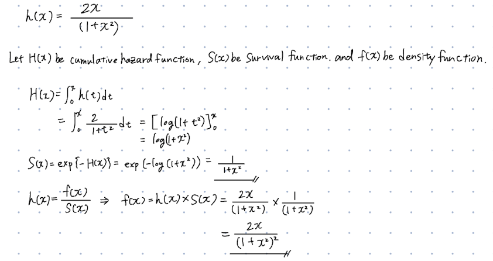
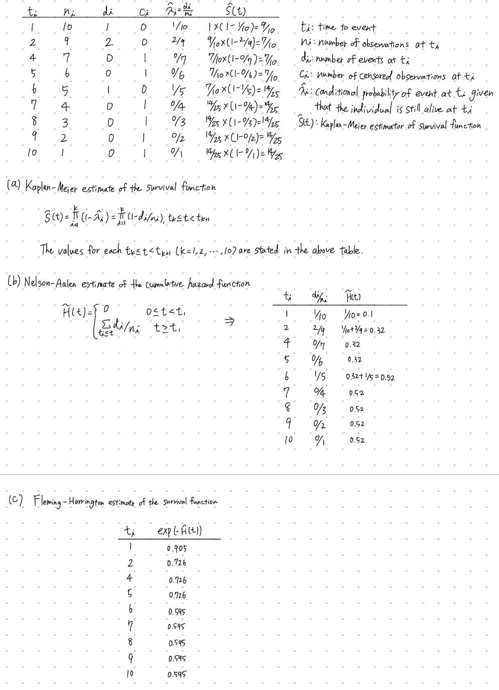

```{r setup, include=FALSE}
knitr::opts_chunk$set(echo = T, message = F, warning = F)

library(tidyverse)
library(KMsurv)
library(flexsurv)
library(survminer)

# setup plot theme
theme_set(
  theme_bw() +
    theme(legend.position = "top")
  )
```

# 1
```{r, out.width="1.0\\linewidth", include=TRUE, fig.align="center", echo=FALSE}

```

# 2
```{r, out.width="1.0\\linewidth", include=TRUE, fig.align="center", echo=FALSE}

```

# 3

`tongue` data contains the following columns:  
- `type` Tumor DNA profile (1 = Aneuploid Tumor, 2 = Diploid Tumor)  
- `time` Time to death or on-study time, weeks  
- `delta` Death indicator (0 = alive, 1 = dead)  
Here we consider individuals with `delta` = 0 as right censored ones.  

```{r}
# data import
data("tongue")

str(tongue)
# check censored 
Surv(tongue$time, tongue$delta, type = "right")

# plot Kaplan-Meier curve of survival function 
ggsurvplot(survfit(Surv(time, delta) ~ type, data = tongue, conf.type = "log"), conf.int = TRUE, xlab = "Weeks") # CI using the log transformation
```

The Kaplan-Meier curve of survival function and its pointwise 95% CI using the log transformation is shown above.

```{r}
# estimated 1-year (52 weeks) survival rate and 95% CI
KM <- survfit(Surv(time, delta) ~ type, data = tongue, conf.type = "log")

summary(KM, times = 52)
```

Given the output, individuals with Aneuploid Tumor (`type` = 1) have an estimated 1-year (52 weeks) survival rate of 0.654 (95% CI: 0.537 - 0.797) and individuals with Diploid Tumor (`type` = 2) have that of 0.4864 (95% CI: 0.3302 - 0.7164).  

