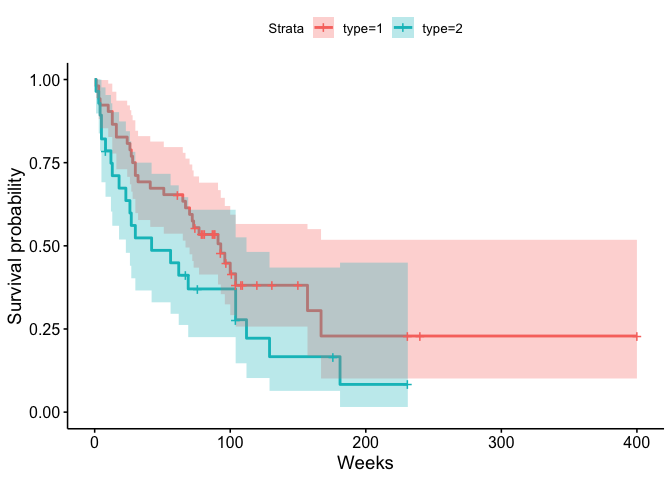

Homework 9
================
Yuki Joyama
2024-04-23

\#1

\#2

\#3

`tongue` data contains the following columns:  
- `type` Tumor DNA profile (1 = Aneuploid Tumor, 2 = Diploid Tumor)  
- `time` Time to death or on-study time, weeks  
- `delta` Death indicator (0 = alive, 1 = dead)  
Here we consider individuals with `delta` = 0 as right censored ones.

``` r
# data import
data("tongue")

str(tongue)
```

    ## 'data.frame':    80 obs. of  3 variables:
    ##  $ type : int  1 1 1 1 1 1 1 1 1 1 ...
    ##  $ time : int  1 3 3 4 10 13 13 16 16 24 ...
    ##  $ delta: int  1 1 1 1 1 1 1 1 1 1 ...

``` r
# check censored 
Surv(tongue$time, tongue$delta, type = "right")
```

    ##  [1]   1    3    3    4   10   13   13   16   16   24   26   27   28   30   30 
    ## [16]  32   41   51   65   67   70   72   73   77   91   93   96  100  104  157 
    ## [31] 167   61+  74+  79+  80+  81+  87+  87+  88+  89+  93+  97+ 101+ 104+ 108+
    ## [46] 109+ 120+ 131+ 150+ 231+ 240+ 400+   1    3    4    5    5    8   12   13 
    ## [61]  18   23   26   27   30   42   56   62   69  104  104  112  129  181    8+
    ## [76]  67+  76+ 104+ 176+ 231+

``` r
# plot Kaplan-Meier curve of survival function 
ggsurvplot(survfit(Surv(time, delta) ~ type, data = tongue, conf.type = "log"), conf.int = TRUE, xlab = "Weeks") # CI using the log transformation
```

<!-- -->

The Kaplan-Meier curve of survival function and its pointwise 95% CI
using the log transformation is shown above.

``` r
# estimated 1-year (52 weeks) survival rate and 95% CI
KM <- survfit(Surv(time, delta) ~ type, data = tongue, conf.type = "log")

summary(KM, times = 52)
```

    ## Call: survfit(formula = Surv(time, delta) ~ type, data = tongue, conf.type = "log")
    ## 
    ##                 type=1 
    ##         time       n.risk      n.event     survival      std.err lower 95% CI 
    ##       52.000       34.000       18.000        0.654        0.066        0.537 
    ## upper 95% CI 
    ##        0.797 
    ## 
    ##                 type=2 
    ##         time       n.risk      n.event     survival      std.err lower 95% CI 
    ##      52.0000      13.0000      14.0000       0.4864       0.0961       0.3302 
    ## upper 95% CI 
    ##       0.7164

Given the output, individuals with Aneuploid Tumor (`type` = 1) have an
estimated 1-year (52 weeks) survival rate of 0.654 (95% CI: 0.537 -
0.797) and individuals with Diploid Tumor (`type` = 2) have that of
0.4864 (95% CI: 0.3302 - 0.7164).
